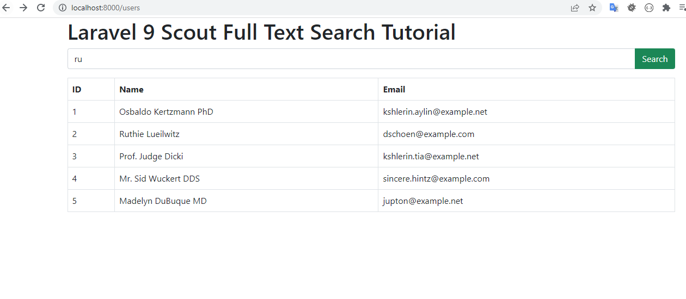

# laravel9_scout_full_text_search
## 1: Install Laravel 9
```Dockerfile
composer create-project laravel/laravel laravel9_scout_full_text_search
```
## 2: Install Scout
```Dockerfile
composer require laravel/scout
```
- chúng ta phải publish our configuration file. vì vậy bạn cần chạy lệnh dưới đây:
```Dockerfile
php artisan vendor:publish --provider="Laravel\Scout\ScoutServiceProvider"
```
- Vào .env
```Dockerfile
SCOUT_DRIVER=database
```
## 3:  Update User Model
-  app/Models/User.php
```Dockerfile
<?php
  
namespace App\Models;
    
use Illuminate\Contracts\Auth\MustVerifyEmail;
use Illuminate\Database\Eloquent\Factories\HasFactory;
use Illuminate\Foundation\Auth\User as Authenticatable;
use Illuminate\Notifications\Notifiable;
use Laravel\Sanctum\HasApiTokens;
use Laravel\Scout\Searchable;
   
class User extends Authenticatable
{
    use HasApiTokens, HasFactory, Notifiable, Searchable;
  
    /**
     * The attributes that are mass assignable.
     *
     * @var array

     */
    protected $fillable = [
        'name',
        'email',
        'password'
    ];
  
    /**
     * The attributes that should be hidden for serialization.
     *
     * @var array

     */
    protected $hidden = [
        'password',
        'remember_token',
    ];
  
    /**
     * The attributes that should be cast.
     *
     * @var array

     */
    protected $casts = [
        'email_verified_at' => 'datetime',
    ];
  
    /**
     * Get the indexable data array for the model.
     *
     * @return array
     */
    public function toSearchableArray()
    {
        return [
            'name' => $this->name,
            'email' => $this->email
        ];
    }
}
```
## 4: Create Dummy Records
```Dockerfile
php artisan tinker 
User::factory()->count(20)->create()
```
## 5: Import Records:
```Dockerfile
php artisan scout:import "App\Models\User"
```
## 6: Create UserController Controller
-  app/Http/Controllers/UserController.php
```Dockerfile
<?php
  
namespace App\Http\Controllers;
  
use Illuminate\Http\Request;
use App\Models\User;
  
class UserController extends Controller
{
    /**
     * Display a listing of the resource.
     *
     * @return \Illuminate\Http\Response
     */
    public function index(Request $request)
    {
        if($request->filled('search')){
            $users = User::search($request->search)->get();
        }else{
            $users = User::get();
        }
          
        return view('users', compact('users'));
    }
}
```
## 7: Add Route
-  routes/web.php
```Dockerfile
<?php
  
use Illuminate\Support\Facades\Route;
  
use App\Http\Controllers\UserController;
  
/*
|--------------------------------------------------------------------------
| Web Routes
|--------------------------------------------------------------------------
|
| Here is where you can register web routes for your application. These
| routes are loaded by the RouteServiceProvider within a group which
| contains the "web" middleware group. Now create something great!
|
*/
  
Route::get('users', [UserController::class, 'index']);
```
## 8: Create View
-  resources/views/users.blade.php
```Dockerfile
<!DOCTYPE html>
<html>
<head>
    <title>Laravel 9 Scout Full Text Search Tutorial</title>
    <link href="https://cdnjs.cloudflare.com/ajax/libs/twitter-bootstrap/5.0.1/css/bootstrap.min.css" rel="stylesheet">
</head>
<body>
      
<div class="container">
    <h1>Laravel 9 Scout Full Text Search Tutorial</h1>
  
    <form method="GET">
        <div class="input-group mb-3">
          <input 
            type="text" 
            name="search" 
            value="{{ request()->get('search') }}" 
            class="form-control" 
            placeholder="Search..." 
            aria-label="Search" 
            aria-describedby="button-addon2">
          <button class="btn btn-success" type="submit" id="button-addon2">Search</button>
        </div>
    </form>
  
    <table class="table table-bordered data-table">
        <thead>
            <tr>
                <th>ID</th>
                <th>Name</th>
                <th>Email</th>
            </tr>
        </thead>
        <tbody>
            @foreach($users as $user)
            <tr>
                <td>{{ $user->id }}</td>
                <td>{{ $user->name }}</td>
                <td>{{ $user->email }}</td>
            </tr>
            @endforeach
        </tbody>
    </table>
</div>
    
</body>
    
</html>
```
## 9: Run Laravel App:
```Dockerfile
php artisan serve
```
- Vào http://localhost:8000/users




